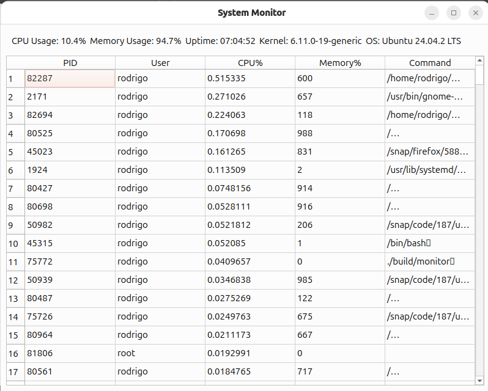

# System Monitor (Qt6 Version)

A system monitoring application built with Qt6, providing real-time information about system resources and processes.



## Features

- Real-time CPU usage monitoring
- Memory utilization tracking
- System uptime display
- Process list with detailed information:
  - Process ID (PID)
  - User
  - CPU usage
  - Memory usage
  - Command name
- System information display:
  - Kernel version
  - Operating System name

## Requirements

- Qt6
- CMake (3.16 or higher)
- C++17 compatible compiler
- Linux system (for system information gathering)

## Building the Project

1. Create a build directory:
```bash
mkdir build
cd build
```

2. Configure with CMake:
```bash
cmake ..
```

3. Build the project:
```bash
make
```

## Running the Application

After building, you can run the application from the build directory:
```bash
./membot-qt6
```

## Project Structure

```
membot-qt6/
├── include/           # Header files
├── src/              # Source files
├── build/            # Build directory (created during build)
└── CMakeLists.txt    # CMake configuration file
```
